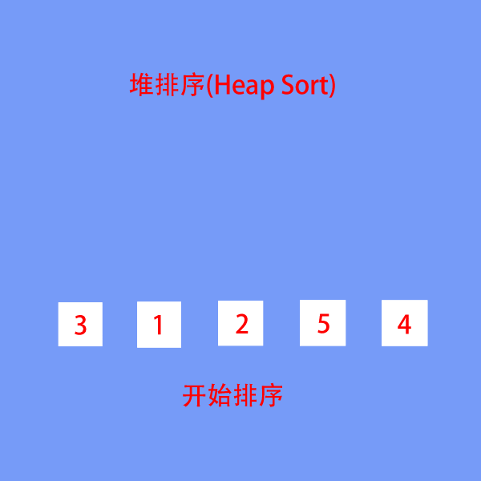
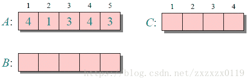

# 排序算法

- [概括](#概括)
- [冒泡排序](#一冒泡排序bubblesort)
- [选择排序](#二选择排序selctionsort)
- [插入排序](#三插入排序insertion-sort)
- [希尔排序](#四希尔排序shell-sort)
- [快速排序](#五快速排序quicksort)
- [归并排序](#六归并排序merge-sort)
- [堆排序](#七堆排序heapsort)
- [基数排序](#八基数排序radixsort)
- [计数排序](#九计数排序counting-sort)
- [桶排序](#十桶排序bucket-sort)

-----
## 概括
排序算法大体可分为两种：
* 比较排序，时间复杂度 O(n*logn) ~ O(n<sup>2</sup>) ，主要有：冒泡排序，选择排序，插入排序，归并排序，堆排序，快速排序等。
* 非比较排序，时间复杂度可以达到O(n)，主要有：计数排序，基数排序，桶排序等。

**关于稳定性**：
* 稳定的排序算法：冒泡排序、插入排序、归并排序和基数排序。
* 不是稳定的排序算法：选择排序、快速排序、希尔排序、堆排序。


> **稳定型**：保证排序前后两个相等的数的相对顺序不变
>    - 稳定：如果a原本在b前面，且a=b，排序之后a仍然在b的前面
>    - 不稳定：如果a原本在b的前面，且a=b，排序之后a可能会出现在b的后面

> **排序方式**
>    - 内部排序：待排序记录存放在计算机随机存储器中（说简单点，就是内存）进行的排序过程
 >   - 外部排序：待排序记录的数量很大，以致于内存不能一次容纳全部记录，所以在排序过程中需要对外存进行访问的排序过程
    
`Swap` 函数（交换数组中某两个位置的值）
```java
static void swap(int[] arr,int i,int j) { 
    int temp = arr[i];
    arr[i] = arr[j]; 
    arr[j] = temp;
}
```
或者
```java
static void swap(int[] arr,int i,int j) {
    arr[i] = arr[i] ^ arr[j];
    arr[j] = arr[i] ^ arr[j];
    arr[i] = arr[i] ^ arr[j];
}
```
## 一、冒泡排序(BubbleSort) 
> 两个数比较大小，较大的数下沉，较小的数冒起来。


### 平均时间复杂度 O(n<sup>2</sup>)

```java
public static void bubbleSort(int[] arr) {
    if (arr == null || arr.length == 0)
        return;
    //通过与相邻元素的比较和交换来把小的数交换到最前面（动图相反过程）
    //for (int i = 0; i < arr.length - 1; i++) 
        // for (int j = arr.length - 1; j > i; j--)
        //     if (arr[j] < arr[j - 1])
        //         swap(arr, j, j - 1);
    for (int i = 0; i < arr.length; i++) 
        for (int j = 0; j < arr.length - i - 1; j++)
            if (arr[j + 1] < arr[j])
                swap(arr, j, j + 1);
}

```
### 优化方案

**问题**：
```数据的顺序排好之后，冒泡算法仍然会继续进行下一轮的比较，直到 arr.length-1 次，后面的比较没有意义的。```

**方案**：
```设置标志位 flag，如果发生了交换 flag 设置为 true；如果没有交换就设置为 false。这样当一轮比较结束后如果 flag 仍为 false，即：这一轮没有发生交换，说明数据的顺序已经排好，没有必要继续进行下去。```
```java
public static void bubbleSort(int[] arr) {
    if (arr == null || arr.length == 0)
        return;
    boolean flag;
    //通过与相邻元素的比较和交换来把小的数交换到最前面（动图相反过程）
    for (int i = 0; i < arr.length - 1; i++) {
        flag = false;
        for (int j = arr.length - 1; j > i; j--) {
            if (arr[j] < arr[j - 1]) {
                swap(arr, j, j - 1);
                flag = true;
            }
        }
        if (!flag)
            break;
    }
}
```

## 二、选择排序(SelctionSort)
> 首先在未排序序列中找到最小（大）元素，存放到排序序列的起始位置，然后，再从剩余未排序元素中继续寻找最小（大）元素，然后放到已排序序列的末尾。以此类推，直到所有元素均排序完毕。


### 平均时间复杂度 O(n<sup>2</sup>)

```java
public static void selectionSort(int[] arr) {
    if (arr == null || arr.length == 0)
        return;
    //只需要比较 n-1 次
    for (int i = 0; i < arr.length - 1; i++) {
        int minIndex = i;
        // 注意从 i+1 开始比较，minIndex 默认为 i,没必要与自身进行比较
        for (int j = i + 1; j < arr.length; j++) {
            if (arr[j] < arr[minIndex])
                minIndex = j;
        }
        //如果 minIndex 不为 i，说明找到了最小值，交换
        if (minIndex != i)
            swap(arr, i, minIndex);
    }
}
```

## 三、插入排序(Insertion Sort)
> 在要排序的一组数中，假定前n-1个数已经排好序，现在将第n个数插到前面的有序数列中，使得这n个数也是排好顺序的。如此反复循环，直到全部排好顺序。


### 平均时间复杂度 O(n<sup>2</sup>)

```java
public static void insertSort(int[] arr) {
    if (arr == null || arr.length == 0)
        return;
    for (int i = 1; i < arr.length; i++) {
        int j = i;
        int target = arr[i];
        // 后移 注意 j=i
        while (j > 0 && target < arr[j - 1]) {
            arr[j] = arr[j - 1];
            j--;
        }
        // 插入
        arr[j] = target;
    }
}
```
另一种简便的写法(直接交换值，不需要插入)
```java
 public static void insertSort(int[] arr) {
    if (arr == null || arr.length == 0)
        return;
    for (int i = 0; i < arr.length - 1; i++) {
        for (int j = i; j > 0 && arr[j] < arr[j - 1]; j--)
            swap(arr, j - 1, j);
    }
}
```

## 四、希尔排序(Shell Sort)
> 在要排序的一组数中，根据某一增量分为若干子序列，并对子序列分别进行插入排序。然后逐渐将增量减小,并重复上述过程。直至增量为1,此时数据序列基本有序,最后进行插入排序。


```java
public static void shellSort(int[] arr) {
    int len = arr.length;
    int temp, gap = len / 2;
    while (gap > 0) {
        for (int i = gap; i < len; i++) {
            temp = arr[i];
            // preIndex 表示上一个节点 
            int preIndex = i - gap;
            // 插入排序 （当上节点的值一直比 temp(arr[i]) 大，将上节点整体后移，最后中间空缺值就是为 temp）
            while (preIndex >= 0 && arr[preIndex] > temp) {
                arr[preIndex + gap] = arr[preIndex];
                preIndex -= gap;
            }
            // 注意 preIndex 值的变化
            arr[preIndex + gap] = temp;
        }
        gap /= 2;
    }
}
```

## 五、快速排序(QuickSort)
> 先从数列中取出一个数作为 key 值，将比这个数小的数全部放在它的左边，大于或等于它的数全部放在它的右边，对左右两个小数列重复第二步，直至各区间只有1个数。


### 平均时间复杂度 O(n*logn)

```java
public static void quickSort(int[] arr) {
    if (arr == null || arr.length == 0)
        return;
    quickProcess(arr, 0, arr.length - 1);
}

static void quickProcess(int[] arr, int L, int R) {
    if (L >= R)
        return;
    int p = partition(arr, L, R);
    quickProcess(arr, L, p - 1);
    quickProcess(arr, p + 1, R);
}

/**
* 对arr[l...r]部分进行partition操作
* 返回p, 使得arr[L...p-1] < arr[p] ; arr[p+1...R] > arr[p]（并不有序）
*/
static int partition(int[] arr, int L, int R) {
    //直接选取 arr[L] 作为 pivot(中心点)
    int key = arr[L];
    int pivot = L;
    for (int i = L + 1; i <= R; i++) {
        if (arr[i] < key)
            swap(arr, i, ++pivot);
    }
    // 将arr[L]放到pivot位置(中间) --> 完全了按照arr[L]划分数组的目的
    swap(arr, pivot, L);
    return pivot;
}
```

## 六、归并排序(Merge Sort)
> 归并排序是分治法一个很好的应用，先递归到最底层，然后从下往上每次两个序列进行归并合起来，是一个由上往下分开，再由下往上合并的过程。


### 平均时间复杂度 O(n*logn)

```java
public static void mergeSort(int[] arr) {
    if (arr == null || arr.length <= 1)
        return;
    mergeProcess(arr, 0, arr.length - 1);
}

static void mergeProcess(int[] arr, int L, int R) {
    if (L >= R)
        return;  
    //相当于 (R+L)/2;
    int mid = L + ((R - L) >> 1); 
    mergeProcess(arr, L, mid); 
    mergeProcess(arr, mid + 1, R); 
    /** 这个是一个优化，因为arr[L,mid]和arr[mid+1,R]已经有序，
     * 所以如果满足这个条件，就不要排序了,防止一开始数组有序 */
    if (arr[mid] > arr[mid + 1])
        merge(arr, L, mid, R); 
}

static void merge(int[] arr, int L, int mid, int R) {
    int[] help = new int[R - L + 1];
    int k = 0;
    int p1 = L, p2 = mid + 1;
    while (p1 <= mid && p2 <= R)
         //左右两边相等的话，就先拷贝左边的(实现稳定性)
        help[k++] = arr[p1] <= arr[p2] ? arr[p1++] : arr[p2++]; 
    //左边剩余的部分
    while (p1 <= mid)  
        help[k++] = arr[p1++];
    //右边剩余的部分
    while (p2 <= R)   
        help[k++] = arr[p2++];
    //拷贝回原来的数组
    for (int i = 0; i < k; i++) 
        arr[i + L] = help[i];
}
```

## 七、堆排序(HeapSort)
> 堆排序是指利用堆这种数据结构所设计的一种排序算法。堆积是一个近似完全二叉树的结构，并同时满足堆积的性质：即子结点的键值或索引总是小于（或者大于）它的父节点。


```java
public static int[] heapSort(int[] arr) {
    int n = arr.length;
    //构建大顶堆
    for (int i = (n - 2) / 2; i >= 0; i--) {
        downAdjust(arr, i, n - 1);
    }
    //进行堆排序
    for (int i = n - 1; i >= 1; i--) {
        // 把堆顶元素与最后一个元素交换
        int temp = arr[i];
        arr[i] = arr[0];
        arr[0] = temp;
        // 把打乱的堆进行调整，恢复堆的特性
        downAdjust(arr, 0, i - 1);
    }
    return arr;
}

//下沉操作
static void downAdjust(int[] arr, int parent, int n) {
    //临时保存要下沉的元素
    int temp = arr[parent];
    //定位左孩子节点的位置
    int child = 2 * parent + 1;
    //开始下沉
    while (child <= n) {
        // 如果右孩子节点比左孩子大，则定位到右孩子
        if (child + 1 <= n && arr[child] < arr[child + 1])
            child++;
        // 如果孩子节点小于或等于父节点，则下沉结束
        if (arr[child] <= temp)
            break;
        // 父节点进行下沉
        arr[parent] = arr[child];
        parent = child;
        child = 2 * parent + 1;
    }
    arr[parent] = temp;
}
```

## 八、基数排序(RadixSort)
> 基数排序是按照低位先排序，然后收集；再按照高位排序，然后再收集；依次类推，直到最高位。


```java
public static void RadixSort(int[] arr) {
    if (arr == null || arr.length <= 1)
        return;
    int max = arr[0];
    for (int i = 1; i < arr.length; i++)
        max = Math.max(max, arr[i]);
    //计算出最大数的位数
    int maxDigit = 0;
    while (max != 0) {
        max /= 10;
        maxDigit++;
    }
    int mod = 10, div = 1;
    ArrayList<ArrayList<Integer>> bucketList = new ArrayList<>();
    for (int i = 0; i < 10; i++)
        bucketList.add(new ArrayList<Integer>());
    for (int i = 0; i < maxDigit; i++, mod *= 10, div *= 10) {
        for (int j = 0; j < arr.length; j++) {
            // 当前所在位的值
            int num = (arr[j] % mod) / div;
            bucketList.get(num).add(arr[j]);
        }
        int index = 0;
        for (int j = 0; j < bucketList.size(); j++) {
            for (int k = 0; k < bucketList.get(j).size(); k++)
                arr[index++] = bucketList.get(j).get(k);
            bucketList.get(j).clear();
        }
    }
}
```

## 九、计数排序(Counting Sort)
> * 找出待排序的数组中最大和最小的元素
> * 统计数组中每个值为i的元素出现的次数，存入数组C的第i项
> * 对所有的计数累加（从C中的第一个元素开始，每一项和前一项相加）
> * 反向填充目标数组：将每个元素i放在新数组的第C(i)项，每放一个元素就将C(i)减去1。





```java
public static void CountingSort(int[] arr) {
        if (arr == null || arr.length == 0)
            return;
        int bias, min = arr[0], max = arr[0];
        for (int i = 1; i < arr.length; i++) {
            if (arr[i] > max)
                max = arr[i];
            if (arr[i] < min)
                min = arr[i];
        }
        bias = 0 - min;
        int[] bucket = new int[max - min + 1];
        Arrays.fill(bucket, 0);
        for (int i = 0; i < arr.length; i++)
            bucket[arr[i] + bias]++;
        int index = 0, i = 0;
        while (index < arr.length) {
            if (bucket[i] != 0) {
                arr[index] = i - bias;
                bucket[i]--;
                index++;
            } else {
                i++;
            }
        }
    }
```

## 十、桶排序（Bucket Sort）
> 假设输入数据服从均匀分布，将数据分到有限数量的桶里，每个桶再分别排序


```java
public static void bucketSort(int[] arr) {
    if (arr == null || arr.length < 2)
        return;

    int n = arr.length;
    int max = arr[0];
    int min = arr[0];
    // 寻找数组的最大值与最小值
    for (int i = 1; i < n; i++) {
        if (min > arr[i])
            min = arr[i];
        if (max < arr[i])
            max = arr[i];
    }
    //和优化版本的计数排序一样，弄一个大小为 min 的偏移值
    int d = max - min;
    //创建 d / 5 + 1 个桶，第 i 桶存放  5*i ~ 5*i+5-1范围的数
    int bucketNum = d / 5 + 1;
    ArrayList<LinkedList<Integer>> bucketList = new ArrayList<>(bucketNum);
    //初始化桶
    for (int i = 0; i < bucketNum; i++) {
        bucketList.add(new LinkedList<Integer>());
    }
    //遍历原数组，将每个元素放入桶中
    for (int i = 0; i < n; i++) {
        bucketList.get((arr[i] - min) / d).add(arr[i] - min);
    }
    //对桶内的元素进行排序，我这里采用系统自带的排序工具
    for (int i = 0; i < bucketNum; i++) {
        Collections.sort(bucketList.get(i));
    }
    //把每个桶排序好的数据进行合并汇总放回原数组
    int k = 0;
    for (int i = 0; i < bucketNum; i++) {
        for (Integer t : bucketList.get(i)) {
            arr[k++] = t + min;
        }
    }
}
```