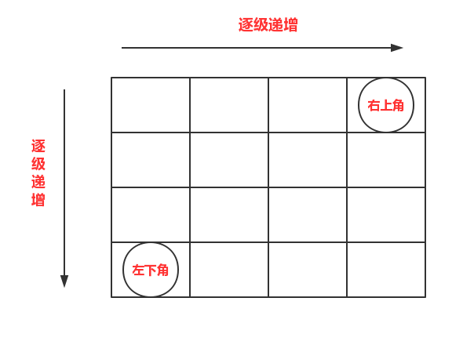

## [二维数组中的查找](https://www.nowcoder.com/practice/abc3fe2ce8e146608e868a70efebf62e)

<code style="color: var(--vscode-textPreformat-foreground); font-family: Menlo, Monaco, Consolas, &quot;Droid Sans Mono&quot;, &quot;Courier New&quot;, monospace, &quot;Droid Sans Fallback&quot;; font-size: 14px; line-height: 19px;">查找</code><span>&nbsp;</span>|<span>&nbsp;</span><code style="color: var(--vscode-textPreformat-foreground); font-family: Menlo, Monaco, Consolas, &quot;Droid Sans Mono&quot;, &quot;Courier New&quot;, monospace, &quot;Droid Sans Fallback&quot;; font-size: 14px; line-height: 19px;">数组</code>

#### 题目描述

> 在一个二维数组中（每个一维数组的长度相同），每一行都按照从左到右递增的顺序排序，每一列都按照从上到下递增的顺序排序。请完成一个函数，输入这样的一个二维数组和一个整数，判断数组中是否含有该整数。

---
#### 思路

<center></center>

> 矩阵是有序的，从左下角(或者右上角)来看，向上数字递减，向右数字递增，因此从左下角开始查找，当要查找数字比左下角数字大时，右移；要查找数字比左下角数字小时，上移。

#### 代码
```java
public class Solution {
     public boolean Find(int target, int[][] array) {
        int row = array.length-1,col = 0;
         while(row>=0&&col<array[0].length){
             if(array[row][col]>target)
                 row--;
             else if(array[row][col]<target)
                 col++;
             else
                 return true;
         }
         return false;
    }
}
```