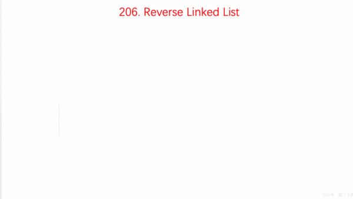

## [反转链表](https://www.nowcoder.com/practice/75e878df47f24fdc9dc3e400ec6058ca)

<code style="color: var(--vscode-textPreformat-foreground); font-family: Menlo, Monaco, Consolas, &quot;Droid Sans Mono&quot;, &quot;Courier New&quot;, monospace, &quot;Droid Sans Fallback&quot;; font-size: 14px; line-height: 19px;">链表</code>

#### 题目描述

> 输入一个链表，反转链表后，输出新链表的表头。

---
* 重点 `cur.next = pre`，注意链表关系，前后指向改变，其对应的其他节点关系也会一起改变(动图来自[五分钟学算法](https://zhuanlan.zhihu.com/p/48405334))
  

#### 思路一
* 使用 `pre`、`next`指针，`pre`指向当前`cur`的前一个，`next`是当前`cur`的下一个指针；
* 改变 `cur.next` 为 `pre`，循环递推，直到 `cur = null`，返回`pre`
```java
public class Solution {
    public ListNode ReverseList(ListNode head) {
        if (head == null || head.next == null)
            return head;
        ListNode pre = null, next = null, cur = head;
        while (cur != null) {
            next = cur.next;
            cur.next = pre; //反转
            pre = cur;  //继续下一次
            cur = next;
        }
        return pre;
    }
}
```

#### 思路二(递归)
* 把 `pre = cur，cur = next`  两行替换成递归，思路一样
```java
public class Solution {
    public ListNode ReverseList(ListNode head) {
        return reverse(head, null);
    }

    public ListNode reverse(ListNode cur, ListNode pre) {
        if (cur == null)
            return pre;
        ListNode next = cur.next;
        cur.next = pre;
        return reverse(next, cur);
    }
}
```
