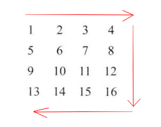

## [顺时针打印矩阵](https://www.nowcoder.com/practice/9b4c81a02cd34f76be2659fa0d54342a)

<code style="color: var(--vscode-textPreformat-foreground); font-family: Menlo, Monaco, Consolas, &quot;Droid Sans Mono&quot;, &quot;Courier New&quot;, monospace, &quot;Droid Sans Fallback&quot;; font-size: 14px; line-height: 19px;">数组</code>

#### 题目描述

> 输入一个矩阵，按照从外向里以顺时针的顺序依次打印出每一个数字，例如，如果输入如下4 X 4矩阵： 1 2 3 4 5 6 7 8 9 10 11 12 13 14 15 16 则依次打印出数字1,2,3,4,8,12,16,15,14,13,9,5,6,7,11,10.

---


#### 思路
* 在矩阵中使用`(ar,ac)`表示左上角，`(br,bc)`表示矩阵的右下角
* 使用这四个关键变量,控制左上和右下的打印范围
* 需要加入条件判断，防止出现单行或者单列的情况

```java
import java.util.ArrayList;

public class Solution {

    private ArrayList<Integer> res;

    public ArrayList<Integer> printMatrix(int[][] matrix) {
        if (matrix == null || matrix.length == 0 || matrix[0].length == 0)
            return null;
        res = new ArrayList<>();
        int ar = 0, ac = 0, br = matrix.length - 1, bc = matrix[0].length - 1;
        while (ar <= br && ac <= bc)
            print(ar++, ac++, br--, bc--, matrix);
        return res;
    }

    private void print(int ar, int ac, int br, int bc, int[][] matrix) {
        if (ar == br)
            for (int j = ac; j <= bc; j++)
                res.add(matrix[ar][j]);
        else if (ac == bc)
            for (int i = ar; i <= br; i++)
                res.add(matrix[i][ac]);
        else {
            for (int j = ac; j < bc; j++)
                res.add(matrix[ar][j]);
            for (int i = ar; i < br; i++)
                res.add(matrix[i][bc]);
            for (int j = bc; j > ac; j--)
                res.add(matrix[br][j]);
            for (int i = br; i > ar; i--)
                res.add(matrix[i][ac]);
        }
    }
}
```
