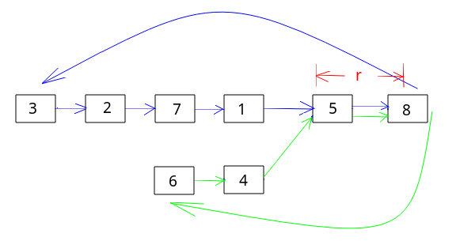

## [两个链表的第一个公共结点](https://www.nowcoder.com/practice/6ab1d9a29e88450685099d45c9e31e46)

<code style="color: var(--vscode-textPreformat-foreground); font-family: Menlo, Monaco, Consolas, &quot;Droid Sans Mono&quot;, &quot;Courier New&quot;, monospace, &quot;Droid Sans Fallback&quot;; font-size: 14px; line-height: 19px;">链表</code>

#### 题目描述

> 输入两个链表，找出它们的第一个公共结点。
---
#### 思路一(使用Set)
```java
import java.util.HashSet;

public class Solution {
    public ListNode FindFirstCommonNode(ListNode pHead1, ListNode pHead2) {
        HashSet<ListNode> set = new HashSet<>();
        for (ListNode cur = pHead1; cur != null; cur = cur.next)
            set.add(cur);
        for (ListNode cur = pHead2; cur != null; cur = cur.next)
            if (set.contains(cur))
                return cur;
        return null;
    }
}
```
#### 思路二
* 计算链表的长度，进行比对，`p1` 为较长的链表，较短的为 `p2`
* 先让 `p1` 走到与 `p2` 相同长度的位置，然后一起走，当 `p1==p2` 时，就是第一个公共节点
```java
public class Solution {
    public ListNode FindFirstCommonNode(ListNode pHead1, ListNode pHead2) {
        if (pHead1 == null || pHead2 == null)
            return null;
        int l1 = len(pHead1), l2 = len(pHead2);
        ListNode p1 = l1 > l2 ? pHead1 : pHead2;
        ListNode p2 = l1 > l2 ? pHead2 : pHead1;
        for (int i = 0; i < Math.abs(l1 - l2); i++)
            p1 = p1.next;
        for (; p1 != null && p1 != p2; p1 = p1.next, p2 = p2.next)
            ;
        return p1;
    }

    private int len(ListNode node) {
        int len = 0;
        for (ListNode cur = node; cur != null; cur = cur.next)
            len++;
        return len;
    }
}
```

#### 思路三



* 类似快慢指针
```java
public class Solution {
    public ListNode FindFirstCommonNode(ListNode pHead1, ListNode pHead2) {
        ListNode p1 = pHead1, p2 = pHead2;
        while(p1 != p2){
            p1 = p1 == null ? pHead1 : p1.next; // 为空回到起点，否则继续下一个
            p2 = p2 == null ? pHead2 : p2.next;
        }
        return p1;
    }
}
```
