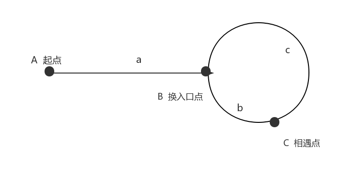

## [链表中环的入口结点](https://www.nowcoder.com/practice/253d2c59ec3e4bc68da16833f79a38e4)

<code style="color: var(--vscode-textPreformat-foreground); font-family: Menlo, Monaco, Consolas, &quot;Droid Sans Mono&quot;, &quot;Courier New&quot;, monospace, &quot;Droid Sans Fallback&quot;; font-size: 14px; line-height: 19px;">链表</code>


#### 题目描述

> 给一个链表，若其中包含环，请找出该链表的环的入口结点，否则，输出null。


#### 思路



* 使用快慢指针，快指针每次走两个距离，慢指针每次走一个距离
* 当第一次在环内相遇时 `a+m*L+b = 2(a+n*L+b)` 则 `a = (m-2*n-1)*L+(L-b) = (m-2*n-1)*L+c`
* 即环前面的路程 = 数个环的长度（为可能为0） + c 
* 所以第一次相遇，两个指针一起走，比较距离相等
```java
public class Solution {
    public ListNode EntryNodeOfLoop(ListNode pHead) {
        if(pHead == null) return null;
        ListNode fast = pHead, slow = pHead;
        while(slow.next != null && fast.next.next != null){
            slow = slow.next;
            fast = fast.next.next;
            if(slow == fast){
                fast = pHead;
                while(slow != fast){
                    slow = slow.next;
                    fast = fast.next;
                }
                return fast;
            }
        }
        return null;
    }
}
```
